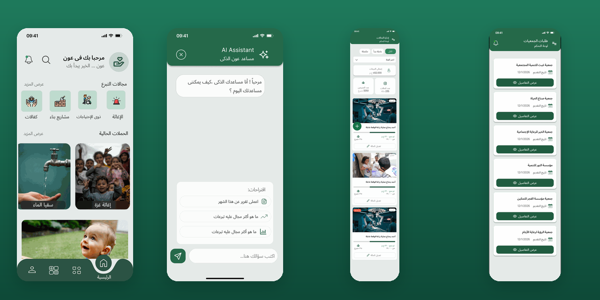
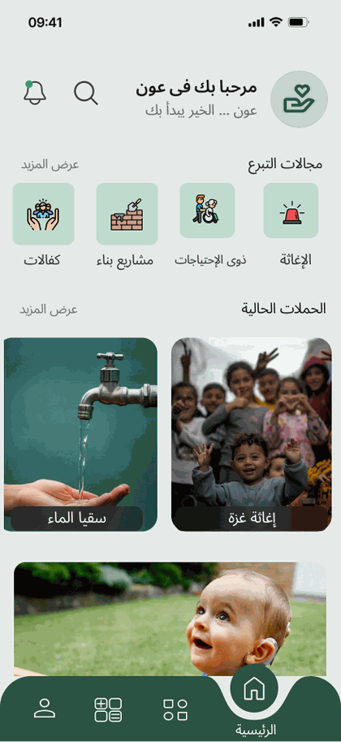
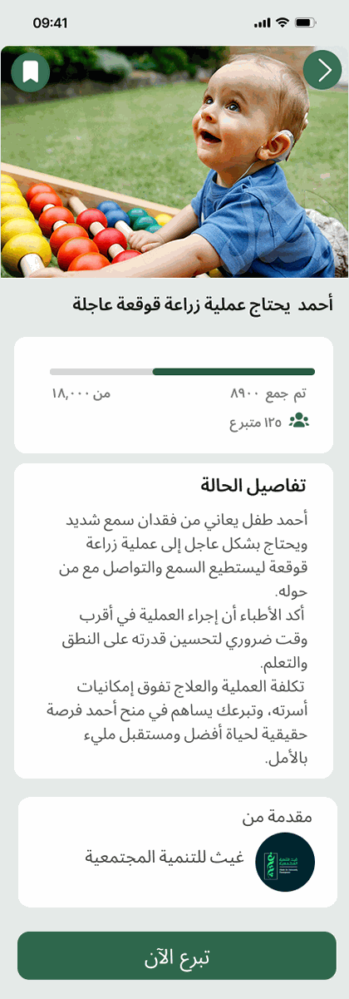
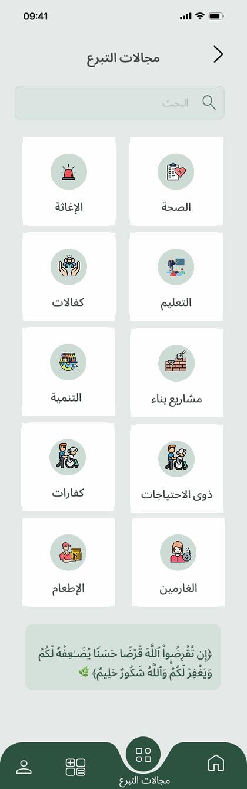
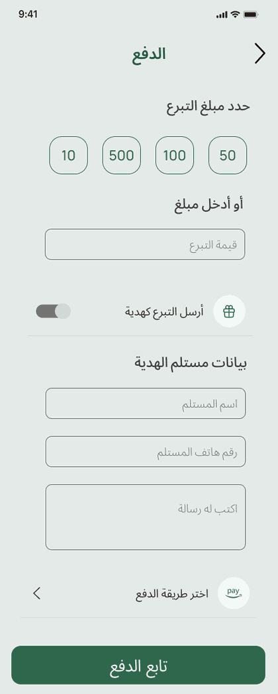
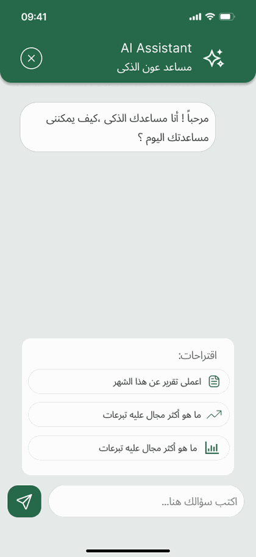
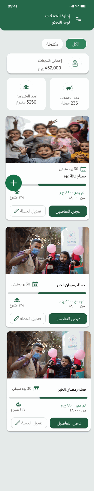
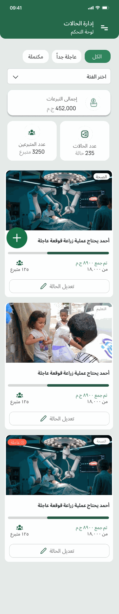
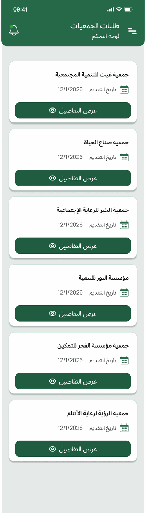
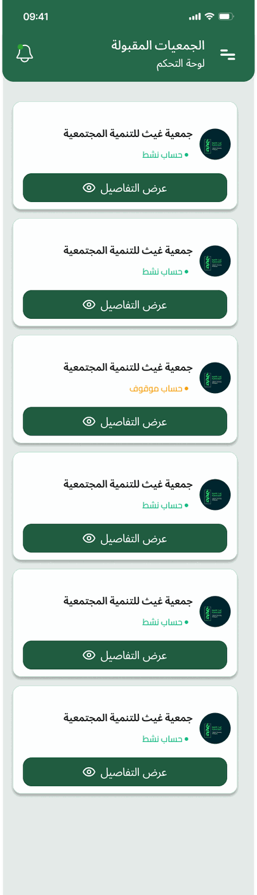

# عون (Aoun) — Smart Charity \& Donation Platform

<p align="center">
  
</p>

<p align="left">
  
  
  
  
  
  
  
  
</p>

## Table of Contents

1. [Project Overview](#1-project-overview)
2. [Features](#2-features)
3. [Technologies](#3-technologies)
4. [Architecture](#4-architecture)
5. [Screenshots](#5-screenshots)
6. [Installation](#6-installation)
7. [Environment Variables](#7-environment-variables)
8. [API](#8-api)
9. [Folder Structure](#9-folder-structure)
10. [Future Work](#10-future-work)
11. [Authors](#11-authors)
12. [License](#12-license)

> 🤝 Contributions welcome — see \[`CONTRIBUTING.md`](./CONTRIBUTING.md).

\---

## 1\. Project Overview

**Aoun (عون — "support/aid" in Arabic)** is a full-stack, Arabic-first charity and donation platform built as a university graduation project at the **Faculty of Computer \& Artificial Intelligence, Beni-Suef University** (final grade: **A+**). The platform's mission is to close the trust and friction gap between everyday donors and verified charitable organizations in Egypt by making it fast, transparent, and safe to give — whether that's a one-time donation to an urgent medical case, a recurring contribution to a relief campaign, or a properly-calculated Zakat payment.

The system is built around **three cooperating applications sharing one backend**:

* A **Flutter mobile app** where donors discover causes, donate, track their giving history, calculate Zakat, and chat with an AI assistant — and where verified charities manage their own campaigns and cases.
* A **React admin panel** used by platform administrators to vet and approve charities, moderate published content, monitor platform-wide financial statistics, and manage users.
* A shared **ASP.NET Core Web API**, built on Clean Architecture, that enforces business rules, security, and data integrity across both clients — backed by a **FastAPI AI Gateway** that adds intelligence on top: a retrieval-augmented chatbot, personalized recommendations, an admin financial assistant, and automatic Arabic marketing copy generation for charities.

**What makes Aoun different from a generic donation app:**

* **Verification-first for charities** — organizations must submit official documents and pass admin review (with AI-assisted document checks) before they can publish a single case, reducing the risk of fraudulent campaigns.
* **Zakat done correctly** — a dedicated calculator for money, gold, silver, and Fitr Zakat, following real nisab rules rather than a rough approximation, with live gold pricing.
* **AI that's grounded, not decorative** — the chatbot and recommendation engine work off real, current platform data (via RAG and collaborative filtering) instead of generic responses, and gracefully fail over across four LLM providers so the experience stays reliable in production.
* **Arabic-native design, not a translated afterthought** — content, layout direction, and the AI content generator are all built for Modern Standard Arabic from the ground up.

> This repository is a \*\*monorepo\*\* unifying the three parts of the system, originally developed and version-controlled across separate repositories by the project team, with the full, real commit history from every sub-project preserved.

**🔗 Live:** *Add your deployed API/admin-panel URL here once hosted (e.g. `https://aoun-api.databaseasp.net`, `https://aoun-admin.vercel.app`).*

```
Aoun/
├── mobile-app/     # Flutter application (donor \& charity facing)
├── admin-panel/    # React admin dashboard
├── backend/        # ASP.NET Core Web API (Clean Architecture)
├── docs/           # Architecture, ERD, sequence diagrams, API docs
└── .github/        # CI workflows
```

\---

## 2\. Features

* **Multi-role platform** — Donor, Charity, and Admin experiences in one system.
* **Campaigns \& Cases** — charities publish campaigns and individual aid cases; donors browse, favorite, and donate.
* **Donations \& Zakat** — dedicated Zakat calculation engine and donation tracking, integrated with **Paymob** for payments.
* **AI donor chatbot** — RAG-based assistant that helps donors find causes and answers platform questions.
* **AI recommendation engine** — hybrid ML (Scikit-Learn) + LLM personalized suggestions.
* **AI admin financial assistant** — helps admins reason about platform financial data.
* **Arabic marketing content generator** — LLM-powered Arabic (MSA) marketing copy for charities.
* **Multi-provider AI fallback routing** — automatic failover across OpenAI, Gemini, DeepSeek, and Groq.
* **Role-Based Access Control (RBAC)** across the API.
* **Notifications, Favorites, Profiles, Charity Dashboard, and Admin Dashboard** modules.

\---

## 3\. Technologies

|Layer|Stack|
|-|-|
|Mobile App|Flutter, Dart, MVVM architecture, Cubit (Bloc) state management, Firebase|
|Admin Panel|React, Vite, Tailwind CSS|
|Backend API|ASP.NET Core 8, C#, Entity Framework Core 8|
|Database|SQL Server|
|Auth|ASP.NET Core Identity, JWT Bearer|
|AI Gateway|Python, FastAPI, Qwen2.5-7B-Instruct, Scikit-Learn|
|Payments|Paymob, Stripe.net|
|Logging|Serilog|
|API Docs|Swagger / Swashbuckle|
|Testing|xUnit|
|CI/CD|GitHub Actions|

\---

## 4\. Architecture

The backend follows **Clean Architecture** and **SOLID** principles:

```
backend/
├── Aoun.API/     # Presentation — Controllers, Middleware, Program.cs
├── Aoun.BLL/     # Business Logic — Services, DTOs, Interfaces, Mapping
├── Aoun.DAL/     # Data Access — DbContext, Entities, Repositories, Migrations
└── Aoun.Tests/   # Unit \& integration tests
```

Design patterns: **Repository + Unit of Work**, **Dependency Injection**, middleware-based cross-cutting concerns, and strategy-style provider routing for AI fallback.

Full breakdown: [`docs/BACKEND-ARCHITECTURE.md`](./docs/BACKEND-ARCHITECTURE.md) · AI Gateway: [`docs/AI-GATEWAY.md`](./docs/AI-GATEWAY.md) · ERD: [`docs/ERD.md`](./docs/ERD.md) · Sequence diagrams: [`docs/SEQUENCE-DIAGRAMS.md`](./docs/SEQUENCE-DIAGRAMS.md) · Flowcharts: [`docs/FLOWCHARTS.md`](./docs/FLOWCHARTS.md)

\---

## 5\. Screenshots

### Donor Experience

|Home Feed|Case Details|Categories|Zakat / Payment|
|-|-|-|-|
|||||

### AI Assistant

|Chat Welcome|
|-|
||

### Charity Management (Campaigns \& Cases)

|Campaigns|Cases|
|-|-|
|||

### Admin — Charity Verification

|Review Requests|Approved Charities|
|-|-|
|||

\---

## 6\. Installation

### Backend (ASP.NET Core API)

```bash
cd backend
dotnet restore
# configure secrets — see Environment Variables below
dotnet ef database update --project Aoun.DAL --startup-project Aoun.API
dotnet run --project Aoun.API
```

### Admin Panel (React)

```bash
cd admin-panel
npm install
npm run dev
```

### Mobile App (Flutter)

```bash
cd mobile-app
flutter pub get
flutter run
```

\---

## 7\. Environment Variables

Never commit real secrets. Configure these via `dotnet user-secrets`, environment variables, or your hosting provider's secret manager.

**Backend** (`backend/Aoun.API`)

|Variable|Purpose|
|-|-|
|`ConnectionStrings\_\_DefaultConnection`|SQL Server connection string|
|`JwtSettings\_\_Secret`|JWT signing key|
|`ApiKeys\_\_Gemini`, `ApiKeys\_\_OpenAI`, `ApiKeys\_\_DeepSeek`, `ApiKeys\_\_Groq`|AI provider keys|
|`GeminiSettings\_\_ApiKey`|Gemini key (chatbot/content generation)|
|`GoldApi\_\_ApiKey`|Live gold price for Zakat calculation|
|`Paymob\_\_ApiKey`, `Paymob\_\_IntegrationId`, `Paymob\_\_IframeId`|Payment gateway|

**Admin Panel** (`admin-panel/.env`, git-ignored)

|Variable|Purpose|
|-|-|
|`VITE\_API\_BASE\_URL`|Backend API base URL|

**Mobile App** — API base URL configured in `mobile-app/lib/core` config.

\---

## 8\. API

Full endpoint reference: [`docs/API.md`](./docs/API.md) (Auth, Campaigns, Cases, Donations, Zakat, Favorites, Profile, Charity, Admin, Notifications, AI). Interactive Swagger UI available at `/swagger` when running the backend in development.

\---

## 9\. Folder Structure

```
Aoun/
├── mobile-app/
│   └── lib/{core, feature, main.dart}
├── admin-panel/
│   └── src/{pages, components, ...}
├── backend/
│   ├── Aoun.API/{Controllers, Middleware, Program.cs}
│   ├── Aoun.BLL/{Services, DTOs, Interfaces, Mapping}
│   ├── Aoun.DAL/{Entities, Repositories, Migrations}
│   └── Aoun.Tests/
├── docs/
│   ├── SRS.md, BACKEND-ARCHITECTURE.md, AI-GATEWAY.md
│   ├── ERD.md, SEQUENCE-DIAGRAMS.md, FLOWCHARTS.md
│   ├── API.md, DEPLOYMENT.md, TESTING.md, FUTURE-IMPROVEMENTS.md
├── .github/workflows/         # CI pipelines
├── CHANGELOG.md
├── CONTRIBUTING.md
└── LICENSE
```

\---

## 10\. Future Work

See [`docs/FUTURE-IMPROVEMENTS.md`](./docs/FUTURE-IMPROVEMENTS.md) — push notifications, multi-currency support, in-app messaging, recurring donations, recommendation model retraining pipeline, and more.

\---

## 11\. Authors

Graduation project — Faculty of Computer \& Artificial Intelligence, Beni-Suef University. Supervised by **Dr. Farid Ali** (Teaching Assistant: Taha Mahmoud).

* **Abdallah Salah Abdallah** — Backend (.NET / Clean Architecture), AI Gateway integration — [GitHub](https://github.com/Abdallah-Salah7)
* **Mohab Mohamed Abdel-Tawab** — Backend (.NET / Clean Architecture)
* **Reham Khalil Ibrahim** — Backend (.NET / Clean Architecture)
* **Nada Adly Mourad** — Mobile (Flutter) , UI and UX
* **Shorouq Rabie Ali** — Mobile (Flutter)
* **Basmala Gaber Mohamed** — Mobile (Flutter)


\---

## 12\. License

MIT — see [`LICENSE`](./LICENSE).

