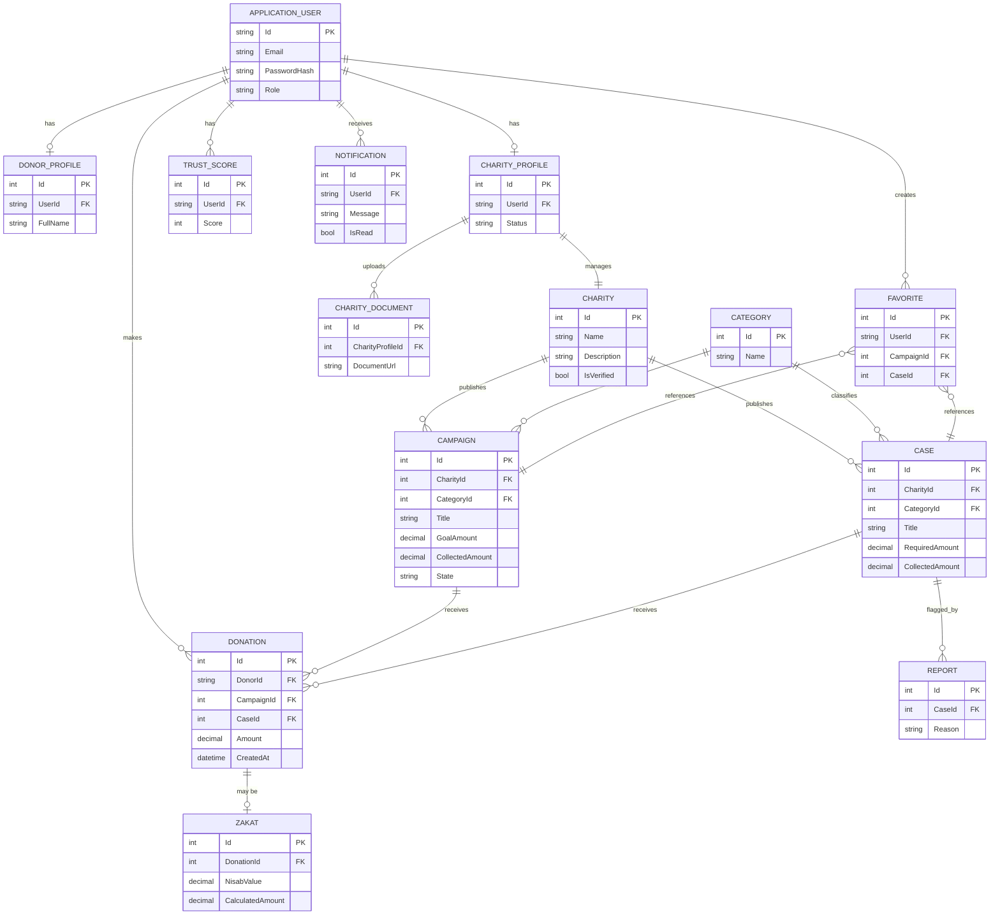

# Database Design — Entity Relationship Diagram

Based on the actual EF Core entities in `backend/Aoun.DAL/Entities`.

> Note: field-level types are best-effort based on the entity classes; refer to `Aoun.DAL/Migrations` for the authoritative, generated schema.
