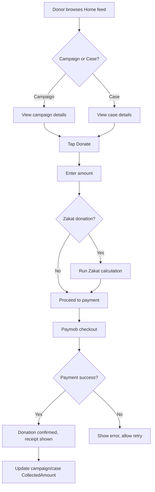
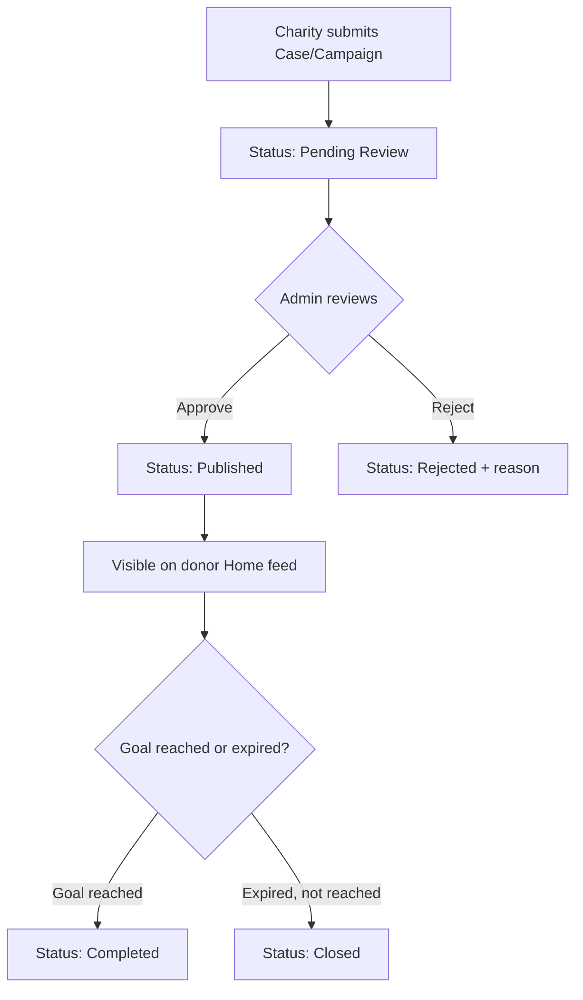
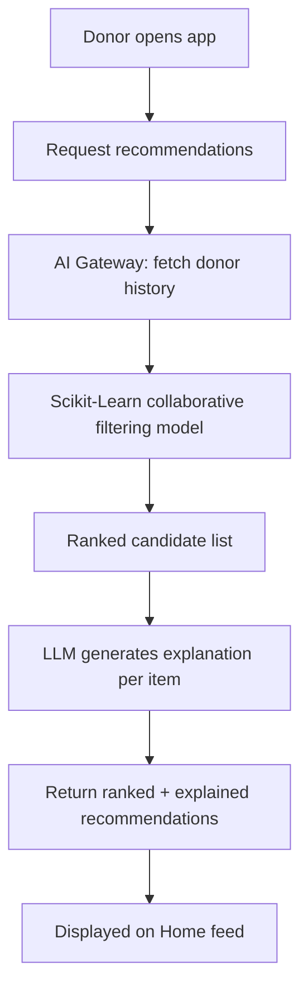

# Flow Charts

## Donation Flow

```mermaid
flowchart TD
    A[Donor browses Home feed] --> B{Campaign or Case?}
    B -->|Campaign| C[View campaign details]
    B -->|Case| D[View case details]
    C --> E[Tap Donate]
    D --> E
    E --> F[Enter amount]
    F --> G{Zakat donation?}
    G -->|Yes| H[Run Zakat calculation]
    G -->|No| I[Proceed to payment]
    H --> I
    I --> J[Paymob checkout]
    J --> K{Payment success?}
    K -->|Yes| L[Donation confirmed, receipt shown]
    K -->|No| M[Show error, allow retry]
    L --> N[Update campaign/case CollectedAmount]
```

## Case/Campaign Moderation Flow

```mermaid
flowchart TD
    A[Charity submits Case/Campaign] --> B[Status: Pending Review]
    B --> C{Admin reviews}
    C -->|Approve| D[Status: Published]
    C -->|Reject| E[Status: Rejected + reason]
    D --> F[Visible on donor Home feed]
    F --> G{Goal reached or expired?}
    G -->|Goal reached| H[Status: Completed]
    G -->|Expired, not reached| I[Status: Closed]
```

## AI Recommendation Flow

```mermaid
flowchart TD
    A[Donor opens app] --> B[Request recommendations]
    B --> C[AI Gateway: fetch donor history]
    C --> D[Scikit-Learn collaborative filtering model]
    D --> E[Ranked candidate list]
    E --> F[LLM generates explanation per item]
    F --> G[Return ranked + explained recommendations]
    G --> H[Displayed on Home feed]
```
