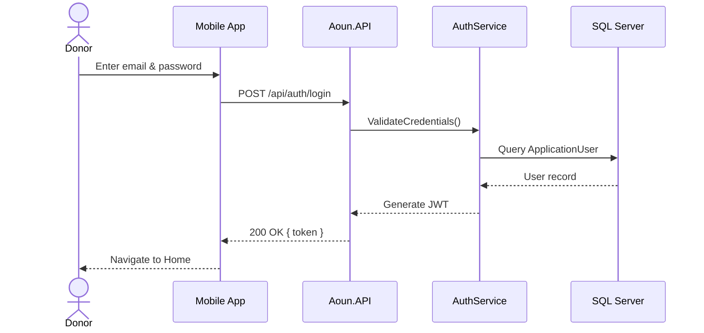
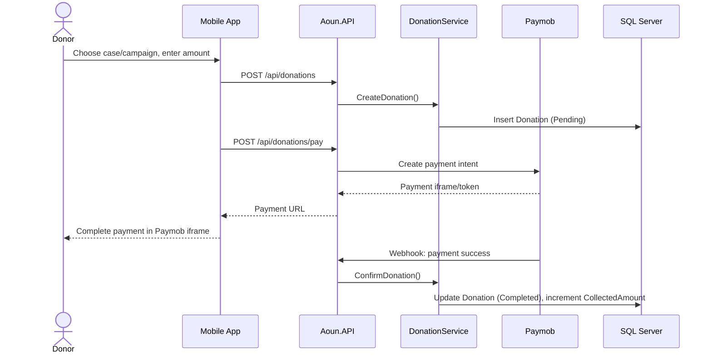
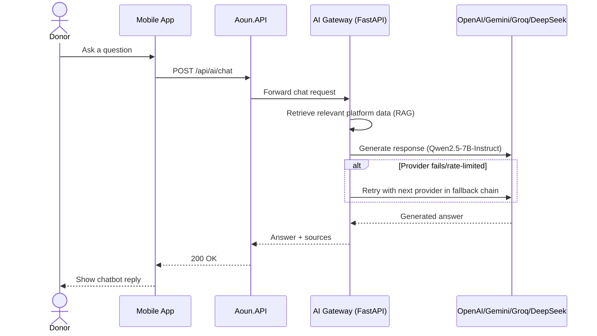
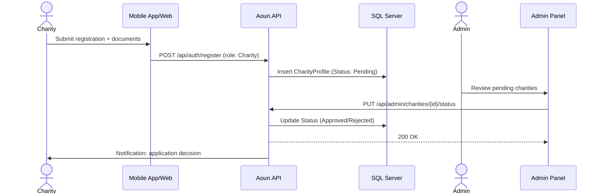

# Sequence Diagrams

## 1. Donor Authentication (Login)

```mermaid
sequenceDiagram
    actor Donor
    participant App as Mobile App
    participant API as Aoun.API
    participant Auth as AuthService
    participant DB as SQL Server

    Donor->>App: Enter email & password
    App->>API: POST /api/auth/login
    API->>Auth: ValidateCredentials()
    Auth->>DB: Query ApplicationUser
    DB-->>Auth: User record
    Auth-->>API: Generate JWT
    API-->>App: 200 OK { token }
    App-->>Donor: Navigate to Home
```

## 2. Making a Donation (with Paymob)

```mermaid
sequenceDiagram
    actor Donor
    participant App as Mobile App
    participant API as Aoun.API
    participant DonationSvc as DonationService
    participant Paymob
    participant DB as SQL Server

    Donor->>App: Choose case/campaign, enter amount
    App->>API: POST /api/donations
    API->>DonationSvc: CreateDonation()
    DonationSvc->>DB: Insert Donation (Pending)
    App->>API: POST /api/donations/pay
    API->>Paymob: Create payment intent
    Paymob-->>API: Payment iframe/token
    API-->>App: Payment URL
    App-->>Donor: Complete payment in Paymob iframe
    Paymob->>API: Webhook: payment success
    API->>DonationSvc: ConfirmDonation()
    DonationSvc->>DB: Update Donation (Completed), increment CollectedAmount
```

## 3. AI Donor Chatbot (RAG)

```mermaid
sequenceDiagram
    actor Donor
    participant App as Mobile App
    participant API as Aoun.API
    participant Gateway as AI Gateway (FastAPI)
    participant Provider as OpenAI/Gemini/Groq/DeepSeek

    Donor->>App: Ask a question
    App->>API: POST /api/ai/chat
    API->>Gateway: Forward chat request
    Gateway->>Gateway: Retrieve relevant platform data (RAG)
    Gateway->>Provider: Generate response (Qwen2.5-7B-Instruct)
    alt Provider fails/rate-limited
        Gateway->>Provider: Retry with next provider in fallback chain
    end
    Provider-->>Gateway: Generated answer
    Gateway-->>API: Answer + sources
    API-->>App: 200 OK
    App-->>Donor: Show chatbot reply
```

## 4. Charity Onboarding & Admin Approval

```mermaid
sequenceDiagram
    actor Charity
    participant App as Mobile App/Web
    participant API as Aoun.API
    participant DB as SQL Server
    actor Admin
    participant AdminPanel as Admin Panel

    Charity->>App: Submit registration + documents
    App->>API: POST /api/auth/register (role: Charity)
    API->>DB: Insert CharityProfile (Status: Pending)
    Admin->>AdminPanel: Review pending charities
    AdminPanel->>API: PUT /api/admin/charities/{id}/status
    API->>DB: Update Status (Approved/Rejected)
    API-->>AdminPanel: 200 OK
    API->>Charity: Notification: application decision
```
